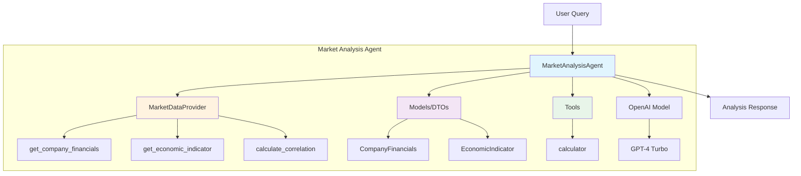
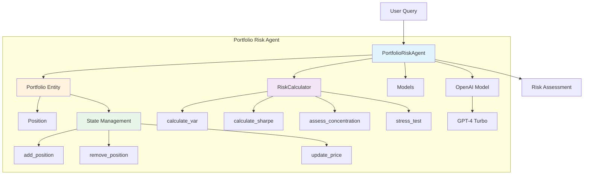
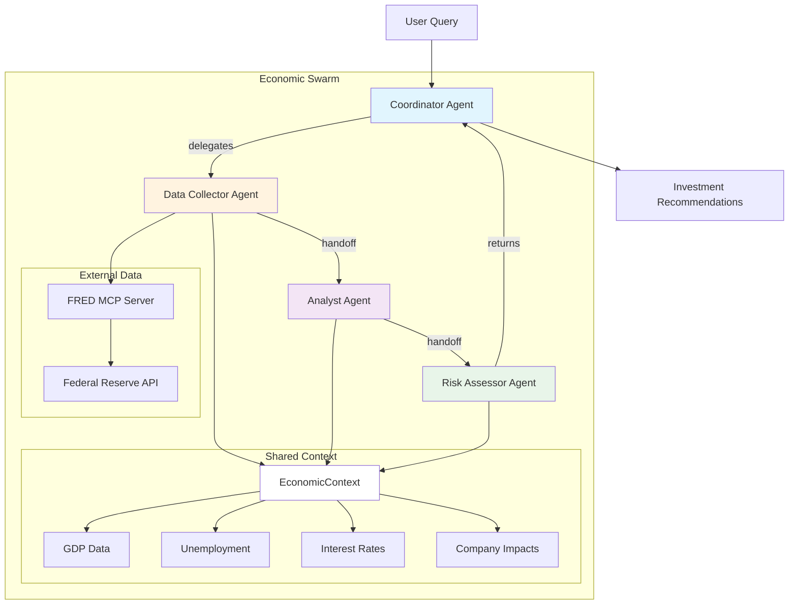

# Building Scalable AI Agents with AWS Strands

## 🎯 Overview

AWS Strands Agents is fresh out of the lab, a brand-new framework for building and orchestrating intelligent agents. In this project, we explore how to tame that new power with a familiar toolset: object-oriented design. 

You'll learn how to:
- Break agents into clean, testable components
- Keep their state organized
- Build systems that are easy to extend as the technology evolves
- Avoid common pitfalls when working with AI agents

## 🚀 Why This Matters

Building AI agents without proper architecture is like building a house without blueprints. As your agent system grows:
- **Without principles**: Tangled code, hard to test, impossible to maintain
- **With principles**: Clean interfaces, testable components, easy to extend

This project demonstrates how to create scalable agents from the beginning that can be easily upgraded, reused, and tested.

## 📚 Table of Contents

1. [Architecture Overview](#architecture-overview)
2. [Agent Examples](#agent-examples)
   - [Market Analysis Agent](#1-market-analysis-agent)
   - [Portfolio Risk Agent](#2-portfolio-risk-agent)
   - [Economic Swarm](#3-economic-swarm-multi-agent-orchestration)
3. [Key Concepts](#key-concepts)
4. [Getting Started](#getting-started)
5. [Running the Demos](#running-the-demos)
6. [Best Practices](#best-practices)

## 🏗️ Architecture Overview

### Core Principles

We apply **Clean Architecture** concepts (without overcomplicating):

1. **Separation of Concerns**: Each component has a single responsibility
2. **Dependency Inversion**: Depend on abstractions, not concretions
3. **Interface Segregation**: Small, focused interfaces
4. **Open/Closed Principle**: Open for extension, closed for modification

### Project Structure

```
aws-community-day-aws-strands/
├── agents/                      # Core agent implementations
│   ├── market_analysis/         # Market Analysis Agent
│   │   ├── __init__.py         # Package exports
│   │   ├── models.py           # Data models (DTOs)
│   │   ├── tools.py            # Tool implementations
│   │   └── agent.py            # Agent orchestration
│   ├── portfolio_risk/          # Portfolio Risk Agent
│   │   ├── __init__.py         
│   │   ├── portfolio.py        # Domain entities
│   │   ├── tools.py            # Risk calculations
│   │   └── agent.py            # Agent orchestration
│   └── economic_swarm/          # Multi-agent swarm
│       ├── __init__.py         
│       ├── models.py           # Shared context models
│       ├── tools.py            # MCP integration
│       ├── agents.py           # Agent factory
│       └── swarm.py            # Swarm orchestrator
└── demos/                       # Demonstration scripts
    ├── swarm/                   # Swarm demonstrations
    └── agents/                  # Individual agent demos
```

## 🤖 Agent Examples

### 1. Market Analysis Agent

**Purpose**: Analyzes financial markets and provides investment recommendations

#### Architecture



#### Key Concepts Demonstrated

- **Data Transfer Objects (DTOs)**: `CompanyFinancials` and `EconomicIndicator` models with computed properties
- **Single Responsibility**: `MarketDataProvider` only handles data access
- **Encapsulation**: Internal data structure hidden behind clean interfaces
- **Composition**: Agent composed of model, tools, and data provider

#### AWS Strands Features Used

- `@tool` decorator for automatic tool registration
- `Agent` class for LLM orchestration
- `OpenAIModel` integration
- Type-safe tool interfaces

### 2. Portfolio Risk Agent

**Purpose**: Assesses portfolio risk and provides risk management recommendations

#### Architecture



#### Key Concepts Demonstrated

- **Entity with State**: `Portfolio` class maintains state across operations
- **Builder Pattern**: Fluent interface for portfolio construction
- **Property Decorators**: Computed properties for derived values
- **Dependency Injection**: Risk calculator depends on portfolio abstraction

#### AWS Strands Features Used

- Stateful agent with memory
- Tool composition for complex calculations
- Context preservation across calls

### 3. Economic Swarm (Multi-Agent Orchestration)

**Purpose**: Orchestrates multiple specialized agents to analyze economic conditions and provide investment recommendations

#### Architecture



#### Key Concepts Demonstrated

- **Factory Pattern**: `AgentFactory` creates specialized agents
- **Strategy Pattern**: Different agents implement different analysis strategies
- **Shared Context**: Agents share `EconomicContext` for collaboration
- **Template Method**: Base swarm behavior with customizable steps
- **Dependency Injection**: MCP client injected into data provider

#### AWS Strands Features Used

- `Swarm` class for multi-agent orchestration
- Agent handoffs with `handoff_to_agent`
- MCP (Model Context Protocol) integration
- Shared context management
- Dynamic tool assignment based on availability

## 🔑 Key Concepts

### From AWS Strands SDK

1. **Agent Abstraction**: High-level interface for LLM-powered agents
2. **Tool Decorators**: Simple `@tool` decorator for function exposure
3. **Swarm Orchestration**: Built-in multi-agent collaboration
4. **MCP Integration**: External data source connectivity
5. **Type Safety**: Full type hints and validation

### From SW Architecture

1. **Separation of Concerns**: Each class has one reason to change
2. **Dependency Inversion**: High-level modules don't depend on low-level modules
3. **Interface Segregation**: Many specific interfaces better than one general
4. **Open/Closed Principle**: Classes open for extension, closed for modification
5. **DRY (Don't Repeat Yourself)**: Reusable components and shared abstractions

### Why These Matter

- **Testability**: Each component can be tested in isolation
- **Maintainability**: Changes in one area don't cascade everywhere
- **Scalability**: Easy to add new agents or capabilities
- **Reusability**: Components can be reused across different agents
- **Flexibility**: Can swap implementations without changing interfaces

## 🚦 Getting Started

### Prerequisites

```bash
# Python 3.9+
python --version

# Install dependencies
pip install -r requirements.txt
```

### Environment Setup

```bash
# Required: OpenAI API key
export OPENAI_API_KEY="your-openai-api-key"

# Optional: FRED API key for real economic data
export FRED_API_KEY="your-fred-api-key"
```

### Quick Test

```python
# Test Market Analysis Agent
from agents.market_analysis import MarketAnalysisAgent

agent = MarketAnalysisAgent()
response = agent.analyze("What is Apple's P/E ratio and is it a good investment?")
print(response)
```

## 🎮 Running the Demos

### Individual Agents

```bash
# Market Analysis Agent
python demos/agents/market_analysis.py          # Basic demo
python demos/agents/market_analysis_visual.py   # Visual demo with live queries

# Portfolio Risk Agent  
python demos/agents/portfolio_risk.py           # Basic demo
python demos/agents/portfolio_risk_visual.py    # Visual demo with live queries
```

### Economic Swarm (Multi-Agent)

```bash
# Different visualization styles
python demos/swarm/basic.py        # Simple execution
python demos/swarm/visual.py       # Enhanced visualization
python demos/swarm/interactive.py  # Step-by-step walkthrough
python demos/swarm/realtime.py     # Real-time monitoring
python demos/swarm/live.py         # Presentation mode
```

## 🧪 Testing: The Power of Good Design

One of the biggest benefits of proper design is **testability**. Every component in this project can be tested in isolation without complex setup or external dependencies.

### Test Structure

```
tests/
├── unit/
│   ├── market_analysis/
│   │   ├── test_models.py      # Pure data classes, no dependencies
│   │   └── test_tools.py       # Tool functions, mockable
│   ├── portfolio_risk/
│   │   ├── test_portfolio.py   # State management testing
│   │   └── test_risk_calculator.py  # Calculation testing
│   └── economic_swarm/
│       └── test_models.py      # Shared context testing
└── run_tests.py                # Test runner with categories
```

### Running Tests

```bash
# Run all tests
python run_tests.py

# Run specific module tests
python run_tests.py --market      # Market analysis only
python run_tests.py --portfolio   # Portfolio risk only
python run_tests.py --swarm       # Economic swarm only

# Show test categories
python run_tests.py --categories
```

### Why Our Components Are Easily Testable

#### 1. Pure Data Classes (Models)

```python
# Easy to test - no external dependencies
class CompanyFinancials:
    def __init__(self, ticker, revenue, eps, debt_to_equity):
        self.ticker = ticker
        self.revenue_billions = revenue
        self.eps = eps
        self.debt_to_equity = debt_to_equity
    
    @property
    def market_cap_estimate(self):
        # Pure calculation - no side effects
        return self.eps * self.pe_ratio * 1_000_000_000

# Test is simple:
def test_market_cap_calculation(self):
    financials = CompanyFinancials("TEST", 100, 5.0, 0.5)
    assert financials.market_cap_estimate == expected_value
```

#### 2. Isolated Tools

```python
@tool
def calculate_correlation(prices1: List[float], prices2: List[float]) -> float:
    """Pure function - input/output, no side effects"""
    return np.corrcoef(prices1, prices2)[0, 1]

# Test without any setup:
def test_correlation(self):
    result = calculate_correlation([1,2,3], [2,4,6])
    assert result > 0.99  # Perfect correlation
```

#### 3. Mockable Dependencies

```python
class RiskCalculator:
    def __init__(self, portfolio: Portfolio):
        self.portfolio = portfolio  # Dependency injection
    
    def calculate_var(self, returns, confidence):
        # Can mock portfolio for testing
        return np.percentile(returns, (1 - confidence) * 100)

# Test with mock:
def test_var_calculation(self):
    mock_portfolio = Mock()
    calculator = RiskCalculator(mock_portfolio)
    var = calculator.calculate_var([-0.02, 0.01], 0.95)
    assert var < 0
```

#### 4. State Management Testing

```python
class Portfolio:
    def __init__(self):
        self._positions = {}  # Encapsulated state
    
    def add_position(self, symbol, shares, price):
        # State mutation - testable
        self._positions[symbol] = Position(symbol, shares, price)
        return self  # Fluent interface

# Test state changes:
def test_add_position(self):
    portfolio = Portfolio()
    portfolio.add_position("AAPL", 100, 150.0)
    assert "AAPL" in portfolio.positions
    assert portfolio.positions["AAPL"].shares == 100
```

### Test Categories and What They Demonstrate

| Category | Files | Demonstrates |
|----------|-------|--------------|
| **Model Tests** | `test_models.py` | • Pure data classes<br>• Computed properties<br>• Business logic isolation<br>• No external dependencies |
| **Tool Tests** | `test_tools.py` | • Independent tool testing<br>• Mock external services<br>• Error handling<br>• Tool registration |
| **Entity Tests** | `test_portfolio.py` | • State management<br>• Fluent interfaces<br>• Aggregation logic<br>• Instance isolation |
| **Calculator Tests** | `test_risk_calculator.py` | • Complex calculations<br>• Statistical functions<br>• Edge cases<br>• Scenario testing |

### Testing Benefits from Design

1. **No Complex Setup**: Each component can be instantiated independently
2. **No External Dependencies**: Tests run without databases, APIs, or files
3. **Fast Execution**: Pure functions and in-memory operations
4. **Predictable**: No shared state between tests
5. **Mockable**: Clear interfaces make mocking trivial
6. **Comprehensive**: Can test edge cases easily

### Example: Testing Without vs With

#### ❌ Without (Hard to Test)

```python
# Everything mixed together - hard to test
def analyze_portfolio():
    # Direct API call - needs real API
    data = requests.get("https://api.market.com/data")
    
    # Direct database access - needs database
    portfolio = db.query("SELECT * FROM positions")
    
    # Calculation mixed with I/O
    for position in portfolio:
        risk = calculate_risk(position, data)
        print(f"Risk: {risk}")  # Output mixed in
    
    return risk  # Which risk? Last one?
```

#### ✅ With (Easy to Test)

```python
class PortfolioAnalyzer:
    def __init__(self, data_provider, portfolio):
        self.data_provider = data_provider  # Inject dependencies
        self.portfolio = portfolio
    
    def calculate_risk(self):
        # Pure business logic
        data = self.data_provider.get_data()
        return sum(p.risk for p in self.portfolio.positions)

# Test is simple:
def test_risk_calculation():
    mock_provider = Mock()
    mock_provider.get_data.return_value = test_data
    
    portfolio = Portfolio()
    portfolio.add_position("AAPL", 100, 150)
    
    analyzer = PortfolioAnalyzer(mock_provider, portfolio)
    risk = analyzer.calculate_risk()
    
    assert risk == expected_risk
```

### Test Coverage Goals

- **Unit Tests**: Test individual methods and functions
- **Integration Tests**: Test component interactions
- **Property Tests**: Test invariants and contracts
- **Edge Cases**: Test boundary conditions
- **Error Cases**: Test failure scenarios

### Running Tests in CI/CD

```yaml
# GitHub Actions example
name: Tests
on: [push, pull_request]

jobs:
  test:
    runs-on: ubuntu-latest
    steps:
      - uses: actions/checkout@v2
      - uses: actions/setup-python@v2
      - run: pip install -r requirements.txt
      - run: python run_tests.py
```

## 💡 Best Practices

### 1. Start with Clear Interfaces

```python
class MarketAnalysisAgent:
    """Clear, single-purpose interface"""
    def analyze(self, query: str) -> str:
        """Analyze market query and return insights"""
        pass
```

### 2. Use Composition Over Inheritance

```python
class PortfolioRiskAgent:
    def __init__(self):
        self.portfolio = Portfolio()  # Composition
        self.calculator = RiskCalculator(self.portfolio)
        self.model = OpenAIModel()
```

### 3. Keep State Isolated

```python
class Portfolio:
    """Encapsulated state management"""
    def __init__(self):
        self._positions = {}  # Private state
    
    @property
    def total_value(self):  # Computed property
        return sum(p.value for p in self._positions.values())
```

### 4. Make Tools Testable

```python
@tool
def calculate_var(portfolio_values: List[float], confidence: float = 0.95) -> float:
    """Pure function - easy to test"""
    return np.percentile(portfolio_values, (1 - confidence) * 100)
```

### 5. Use Factory Pattern for Complex Creation

```python
class AgentFactory:
    """Centralized agent creation"""
    def create_coordinator(self) -> Agent:
        return Agent(
            name="coordinator",
            model=self.model,
            tools=[],
            system_prompt=COORDINATOR_PROMPT
        )
```

## 🎯 Key Takeaways

1. **Clean architecture scales** - Start with good patterns, avoid refactoring later
2. **Testability matters** - Pure functions and clear interfaces make testing easy
3. **Composition enables flexibility** - Swap components without rewriting

## 🚀 What's Next?

- Add more specialized agents (news analysis, sentiment, technical indicators)
- Implement persistent state with databases
- Add real market data feeds
- Create agent training pipelines
- Build production deployment patterns

## 📖 Resources

- [AWS Strands Documentation](https://github.com/AWS/strands-agents)
- [Clean Architecture by Robert Martin](https://blog.cleancoder.com/uncle-bob/2012/08/13/the-clean-architecture.html)
- [SOLID Principles](https://en.wikipedia.org/wiki/SOLID)
- [Model Context Protocol](https://modelcontextprotocol.io/)

## 🤝 Contributing

This is a demonstration project for AWS Community Day. Feel free to fork and experiment!

## 📝 License

MIT License - See LICENSE file for details

---

**Remember**: The goal isn't to over-engineer, but to build agents that can grow with your needs. Start simple, refactor when necessary, and always keep testability in mind.

*Built with ❤️ for AWS Community Day*
